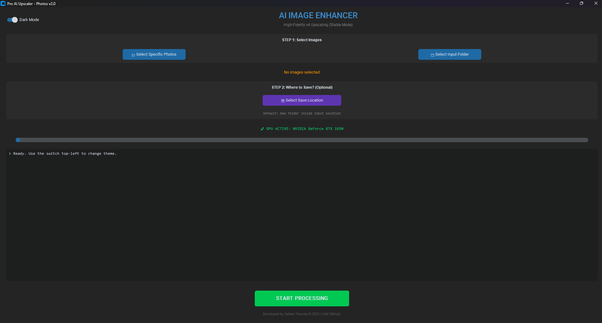

# 🚀 AI Image Upscaler (Photos)

A powerful, local desktop application designed to upscale images by **400% (x4)** while preserving high fidelity. Built specifically for photographers and stock contributors (Adobe Stock, Shutterstock) to meet resolution requirements without quality loss.

**Powered by Real-ESRGAN and CustomTkinter.**

---

## 📸 Screenshots

---

## ✨ Key Features

* **⚡ NVIDIA GPU Acceleration:** Fully optimized for CUDA to process images in seconds using your Graphics Card (GTX/RTX).
* **🧠 Advanced AI Model:** Uses `Real-ESRGAN x4plus` for superior detail restoration (removes noise & JPEG artifacts).
* **🧱 Smart Tiling Technology:** Automatically splits large images into tiles (512x512) to prevent GPU memory crashes and "Black Image" errors.
* **📂 Batch Processing:** Select individual files or entire folders to upscale automatically.
* **🎨 Modern UI:** Beautiful Dark/Light mode interface built with CustomTkinter.
* **🛡️ Privacy Focused:** Runs 100% offline. No data is uploaded to the cloud.

---

## 🛠️ Installation

### Prerequisites
* Python 3.10 or higher
* NVIDIA Graphics Card (Recommended for speed)
* CUDA Toolkit (Optional, but recommended)

### Step 1: Clone the Repository

    git clone [https://github.com/SahanST19/AI-Image-Upscaler.git](https://github.com/SahanST19/AI-Image-Upscaler.git)
    cd AI-Image-Upscaler

### Step 2: Create Virtual Environment

    python -m venv venv
### Windows:
    .\venv\Scripts\activate
### Mac/Linux:
    source venv/bin/activate

### Step 3: Install Dependencies

    This project requires the CUDA version of PyTorch. Run this command specifically:

# Install PyTorch with CUDA 12.1 support
    pip install torch torchvision torchaudio --index-url [https://download.pytorch.org/whl/cu121](https://download.pytorch.org/whl/cu121)

# Install other requirements
    pip install -r requirements.txt

🚀 How to Use
#### 1. Run the application:
       python app.py

2. Click "Select Specific Photos" or "Select Input Folder".

3. (Optional) Choose where to save the output. If skipped, it creates a folder named Upscaled_Output inside your input directory.

4. Click "START PROCESSING".

5. Watch the log for progress!

⚙️ Configuration (Tiling)

The app is optimized for GPUs with 4GB-6GB VRAM (like GTX 1650). It automatically uses Tiling (Tile size: 512).

This prevents "Black Image" errors by breaking the image into smaller chunks during processing and merging them back together.

🤝 Contributing
Contributions are welcome! Please feel free to submit a Pull Request.
1. Fork the Project

2. Create your Feature Branch (git checkout -b feature/NewFeature)

3. Commit your Changes (git commit -m 'Add some NewFeature')

4. Push to the Branch (git push origin feature/NewFeature)

5. Open a Pull Request

👨‍💻 Author

Sahan Tharuka
GitHub: @SahanST19

Note: This tool uses the Real-ESRGAN algorithm developed by Xintao Wang.

